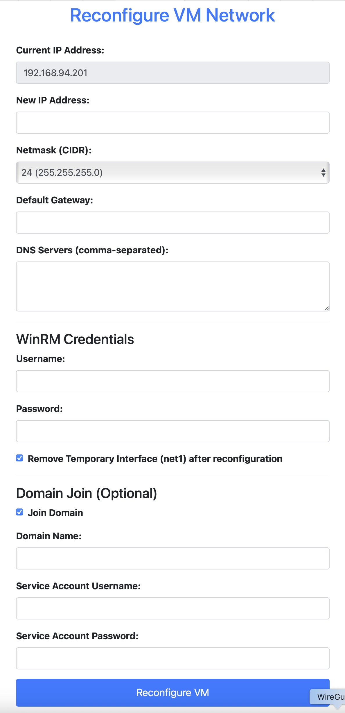

# Proxmox GuestOS Utility

A Flask web application to automate cloning, network configuration, and Sysprep customization of Windows VMs in Proxmox VE.

Two complementary approaches:

| Path | How it works | Best for |
|------|----------------|----------|
| **WinRM reconfigure** | Clone → temp NIC/DHCP → WinRM → apply static IP / hostname / optional domain join | Existing WinRM-ready templates |
| **Sysprep** | Write `unattended.xml` + `SetupComplete.cmd`/`setup.ps1` via QEMU guest agent → `sysprep /generalize` → verify | New clones or existing VMs; no WinRM required for customize |

## Recent Improvements

-   **Security hardening:** eliminated PowerShell command injection (guest values validated and passed via Base64/JSON), stopped leaking WinRM/domain credentials to the browser (resolved server-side), CSRF on forms and JSON endpoints.
-   **Auth/config:** fails fast without `SECRET_KEY`, hardened session cookies, configurable Proxmox TLS verify, in-app change-password page.
-   **Sysprep (validated on Windows Server 2019 and Windows 11):** applies hostname, static or DHCP networking, DNS, optional domain join; domain profiles fill DNS/VLAN; enables Administrator and removes leftover template local users; waits for a *stable* guest agent (Win11-friendly); verifies result via guest agent (no WinRM).
-   **Packaging & CI:** `Dockerfile`, `docker-compose.yml`, `docker-compose.offline.yml` for air-gapped hosts, pinned deps, `pytest` + GitHub Actions.
-   WinRM disable-in-guest was removed (handled by Group Policy in the author’s environment).

## Features

-   Clone VMs from Proxmox templates.
-   Reconfigure network settings on existing lifecycle-managed VMs (WinRM path).
-   Sysprep workflows for **new clones** and **existing VMs**:
    -   Hostname + timezone via answer file
    -   **Static** or **DHCP** guest networking (IP, prefix, gateway, DNS)
    -   Optional Active Directory join (credentials from form or domain profile; AD join not fully lab-validated yet)
    -   Domain profiles optionally fill **DNS** and **VLAN** (same profiles as WinRM)
-   Background tasks with Celery + Redis.
-   Web UI for all operations.

## Project Status

**Active development.**

-   **WinRM reconfiguration** (clone + network reconfigure): considered stable.
-   **Sysprep customization** (hostname + static/DHCP network): validated on **Windows Server 2019** and **Windows 11** in lab. Post-sysprep verification uses the QEMU guest agent.
-   **Domain join** (both paths): implemented; treat as **not fully validated** until you test against your AD.

## Workflow Overview

### WinRM path (clone + reconfigure)

1. Clone from a prepared template (hostname used for Proxmox name and later Windows rename).
2. Attach a temporary NIC on `TEMP_BRIDGE` (DHCP).
3. Wait for an IP in `WINRM_SUBNET`.
4. Connect with WinRM; apply primary NIC settings (and optional domain join).
5. Reboot; optionally remove the temporary NIC.

### Sysprep path

1. Clone from a template **or** pick an existing running VM.
2. Optionally select a **domain profile** (fills DNS/VLAN); choose static or DHCP; optionally join a domain.
3. App waits for a **stable** QEMU guest agent, then writes:
    -   `C:\Windows\System32\Sysprep\unattended.xml`
    -   `C:\Windows\Setup\Scripts\setup.ps1`
    -   `C:\Windows\Setup\Scripts\SetupComplete.cmd` (Windows runs this after setup)
4. Runs `sysprep /generalize /oobe /shutdown` with the answer file.
5. Powers the VM back on, waits for the guest agent again, and verifies hostname / IP (and domain membership when requested).

`setup.ps1` also enables the built-in **Administrator** account and removes other leftover local users from the template (Sysprep itself does not delete them).

## Design Choices

### Why WinRM (for the reconfigure path)?

WinRM is built into modern Windows Server. No Cloudbase-Init on the template, one port (5985) on an isolated temp network. See the original design notes below for detail.

### Why Sysprep + guest agent (for the customize path)?

No dependency on WinRM or a temp NIC for applying hostname/network. Uses the QEMU guest agent (already required for Proxmox integration) and native Windows unattend / SetupComplete. Domain join and network config run from `setup.ps1` after specialize so virtio/e1000 adapter selection can use MAC matching.

### Why WinRM instead of Cloud-Init? (historical)

Cloud-Init on Windows needs Cloudbase-Init. This project prefers native WinRM for the reconfigure path to keep templates minimal.

## Prerequisites

### Proxmox VE

-   Working Proxmox VE cluster/host.
-   API user with privileges to clone, configure, start/stop VMs, and use the guest agent.

### Templates

#### WinRM reconfigure template

-   Windows Server (or client) with **QEMU Guest Agent**, VirtIO drivers, WinRM Basic + AllowUnencrypted (temp network only), firewall allowing TCP 5985.
-   Typically sysprep’d and converted to a Proxmox template.

Example WinRM enablement:

```powershell
winrm quickconfig -q
winrm set winrm/config/service/auth @{Basic="true"}
winrm set winrm/config/service @{AllowUnencrypted="true"}
New-NetFirewallRule -Name "WinRM-HTTP" -DisplayName "WinRM-HTTP" -Protocol TCP -LocalPort 5985 -Action Allow -Enabled True
```

#### Sysprep template / source VM

-   **QEMU Guest Agent** installed and working (`qm agent <vmid> ping` / Proxmox UI).
-   Prefer a clean image: avoid extra local users on the gold image (the app removes leftovers after specialize, but starting clean is better).
-   For **new-VM sysprep**: a Proxmox **template** (or full-cloneable VM).
-   For **existing-VM sysprep**: a running disposable VM (sysprep generalizes it).

Validated guest OS targets so far: **Windows Server 2019**, **Windows 11**.

### Network

-   **WinRM path:** DHCP on `TEMP_BRIDGE`; app host must reach that subnet; keep it a dedicated non-routed L2/VLAN. `PRIMARY_BRIDGE` is typically a trunk for final VLANs.
-   **Sysprep path:** guest agent only from the Proxmox API host’s perspective; static or DHCP on the guest’s primary NIC as configured in the form. Domain join needs DNS that can resolve the DC (profile DNS or manual DNS).

### Software

-   Python 3.12+ (or Docker).
-   Redis (bundled in Compose).
-   Reverse proxy with TLS recommended for production (`BEHIND_REVERSE_PROXY=True`).

## Installation and Setup

```bash
git clone https://github.com/RobertLukan/proxmox-guestos-customization/
cd proxmox-guestos-customization
python3 -m venv venv
source venv/bin/activate
pip install -r requirements.txt
cp .env.example .env
# edit .env — SECRET_KEY is required
python3 init_db.py
```

Default login password: `changeme`. Change it immediately via **Change Password**.

## Running with Docker (recommended)

```bash
cp .env.example .env   # set SECRET_KEY; BEHIND_REVERSE_PROXY=False for local HTTP
docker compose up -d --build
```

App: **http://127.0.0.1:5001**

Compose starts **web** (gunicorn + `init_db.py`), **worker** (Celery), and **Redis**. SQLite lives in the `app-instance` volume.

### Older hosts (Compose V1)

If `docker compose` is missing but `docker-compose` exists:

```bash
docker-compose up -d
```

After changing `.env` on Compose V1 + modern Docker Engine, avoid `--force-recreate` (known `ContainerConfig` bug). Prefer:

```bash
docker-compose stop && docker-compose rm -f && docker-compose up -d
```

### Offline / air-gapped deploy

1. On a build machine (match target CPU, e.g. `linux/amd64` for typical Proxmox utility VMs):

   ```bash
   docker buildx build --platform linux/amd64 -t proxmox-guestos-customization-web:latest --load .
   docker tag proxmox-guestos-customization-web:latest proxmox-guestos-customization-worker:latest
   docker pull --platform linux/amd64 redis:7-alpine
   # ensure redis tag is amd64, then:
   docker save proxmox-guestos-customization-web:latest \
               proxmox-guestos-customization-worker:latest \
               redis:7-alpine | gzip > proxmox-guestos-customization-offline-amd64.tar.gz
   ```

2. On the offline host:

   ```bash
   gunzip -c proxmox-guestos-customization-offline-amd64.tar.gz | docker load
   # copy docker-compose.offline.yml + .env into the same directory
   docker-compose -f docker-compose.offline.yml up -d
   # or: docker compose -f docker-compose.offline.yml up -d
   ```

`docker-compose.offline.yml` uses **images only** (no `build:`), so Compose will not look for a Dockerfile.

**Important:** images built on Apple Silicon default to **arm64**. Proxmox utility hosts are usually **amd64** — always export with `--platform linux/amd64` for those hosts.

## Running manually

Terminal 1 (with Redis running locally):

```bash
source venv/bin/activate
# BEHIND_REVERSE_PROXY=False in .env for direct HTTP
python3 run.py
```

Terminal 2:

```bash
source venv/bin/activate
celery -A app.celery worker --loglevel=info
```

Production-style: `gunicorn --bind 0.0.0.0:5001 wsgi:app` with `BEHIND_REVERSE_PROXY=True` behind TLS.

## Configuration

See `.env.example`. Key variables:

| Variable | Purpose |
|----------|---------|
| `PROXMOX_HOST` / `USER` / `PASSWORD` | Proxmox API (default remote) |
| `PROXMOX_VERIFY_SSL` | TLS verify for Proxmox API (default `False`) |
| `GUESTOS_API_TOKEN` / `API_TOKENS` | Machine API auth for PDM/sysprep start+poll |
| `PVE_REMOTES_JSON` | Optional named remotes (`remote_id` in sysprep JSON) |
| `WINRM_USERNAME` / `PASSWORD` | Default WinRM creds (server-side only; standalone) |
| `WINRM_SUBNET` | Allowed temp IP subnet for WinRM |
| `PRIMARY_BRIDGE` / `TEMP_BRIDGE` | Final vs temporary bridges |
| `SECRET_KEY` | **Required** — sessions + CSRF |
| `APP_VERSION` | Optional override of `VERSION` file (shown in UI / `/api/version`) |
| `BEHIND_REVERSE_PROXY` | ProxyFix + Secure cookies |
| `DATABASE_URL` | SQLAlchemy URL (default SQLite under `instance/`) |
| `CELERY_BROKER_URL` / `CELERY_RESULT_BACKEND` | Redis (Compose overrides to `redis://redis:6379/0`) |
| `PORT` | Listen port (default `5001`) |
| `DOMAIN_PROFILES_JSON` | Named profiles: `dns_servers`, `domain_name`, `domain_username`, `domain_password`, optional `vlan`, optional `domain_ou` |

Domain profiles are used by **both** WinRM reconfigure and Sysprep. Selecting a profile fills DNS/VLAN in the UI; join credentials stay on the server when “Use Domain Profile Credentials” is checked.

## Lab helper scripts

```bash
# Read-only Proxmox connectivity / inventory check
venv/bin/python scripts/smoke_check.py

# Drive existing-VM sysprep synchronously (no Redis/web; generalizes the VM!)
venv/bin/python scripts/sysprep_test.py \
  --vmid 121 --hostname WINSRV19-T1 \
  --ip 192.168.100.121 --netmask 24 --gateway 192.168.100.1 \
  --dns 192.168.100.1,1.1.1.1 --admin-password '...' --yes

# DHCP example
venv/bin/python scripts/sysprep_test.py \
  --vmid 122 --hostname WIN11-T1 --network-mode dhcp \
  --dns 10.0.0.10 --admin-password '...' --yes
```

## Usage

1. Open **http://127.0.0.1:5001** (or your reverse-proxy URL).
2. Log in; change the default password.
3. Clone / reconfigure (WinRM) or run Sysprep from the UI.

## Screenshots

*Illustrative; UI may differ slightly from the current branch.*

### Initial Page


### Clone VM


### Reconfigure VM


### Progress


## Development / Testing

```bash
python3 -m venv venv
source venv/bin/activate
pip install -r requirements-dev.txt
pytest
```

Coverage includes validators, injection-safe PowerShell helpers, WinRM IP selection, tags, CSRF/auth, sysprep template rendering (static/DHCP/domain blob), and domain-profile resolution. Proxmox/WinRM are mocked. CI runs the same suite on GitHub Actions (`pythonpath = .` in `pytest.ini`).

## Security considerations

-   Run behind TLS; set `BEHIND_REVERSE_PROXY=True` in production.
-   Do not expose outside an admin network.
-   Keep the WinRM temp network isolated (non-routed L2).
-   Guest inputs are validated; PowerShell receives Base64/JSON params, not interpolated secrets.
-   WinRM/domain credentials are resolved server-side by default.
-   CSRF is enabled; keep `SECRET_KEY` unique and secret.
-   Change `changeme` immediately after first login.

## Acknowledgements

This project was developed with assistance from AI coding tools (including Google Gemini and Cursor), guided by the author’s requirements and lab validation.
