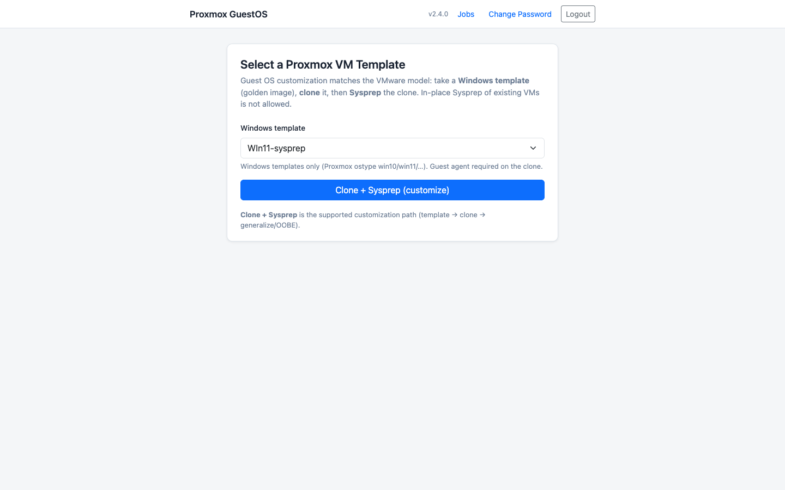
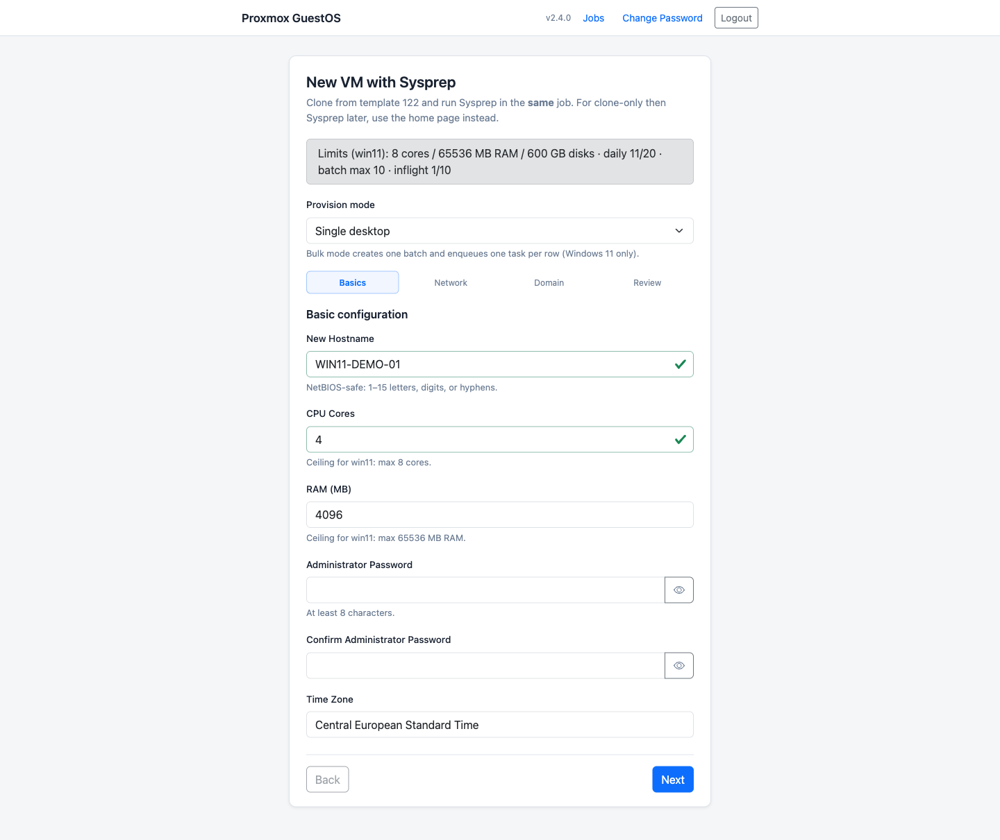
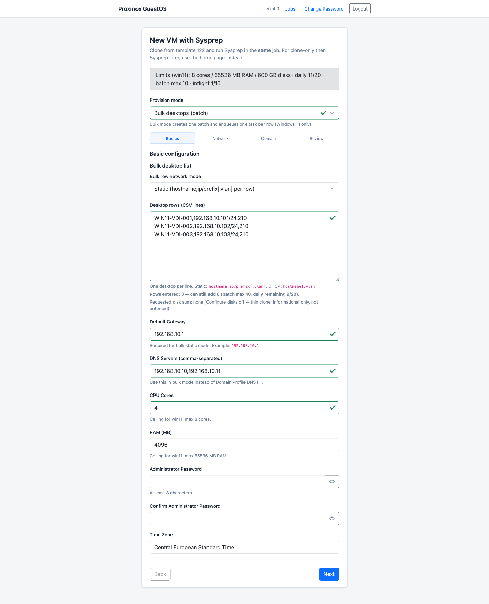
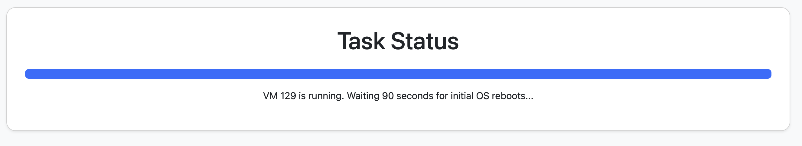
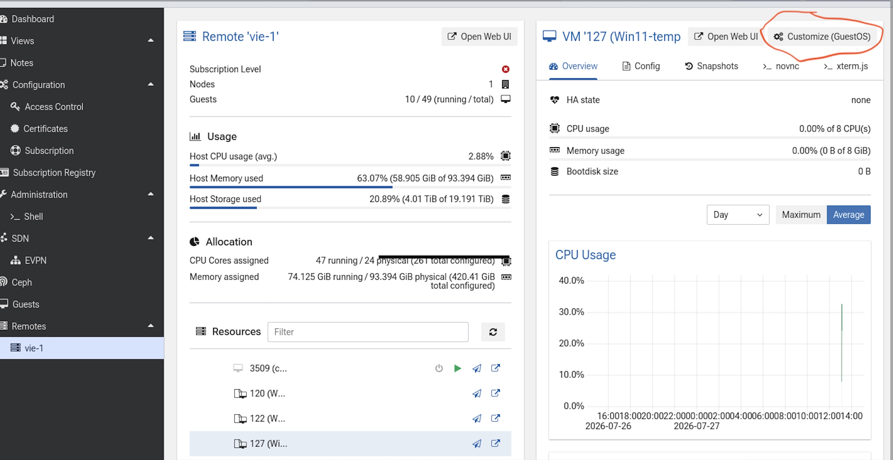

# Proxmox GuestOS Utility

[](https://github.com/RobertLukan/proxmox-guestos-customization/actions/workflows/tests.yml)
[](https://github.com/RobertLukan/proxmox-guestos-customization/actions/workflows/security.yml)
[](https://github.com/RobertLukan/proxmox-guestos-customization/actions/workflows/codeql.yml)

**Current release: [2.6.8](VERSION)** — community project for **Sysprep guest OS customization** of Windows VMs in Proxmox VE (VMware-style: golden image template → clone → customize), including **bulk Win11 desktop provisioning** with safeguards.

> **Not an official Proxmox product.** Lab-validated matrix (versions + editions):
> [docs/VALIDATED_MATRIX.md](docs/VALIDATED_MATRIX.md). Server 2025 and several
> editions still need **community test reports**. Support is community / GitHub
> issues only — [open an issue](https://github.com/RobertLukan/proxmox-guestos-customization/issues).

GuestOS is **Sysprep-only** (template → clone → guest agent). In-place Sysprep of existing/production VMs is **disabled**.

| Path | Status | How it works |
|------|--------|----------------|
| **Sysprep customize** | **Supported** (only path) | Template → clone → guest-agent writes unattend + `setup.ps1` → `sysprep /generalize` → verify |
| **Bulk Win11 batch** | **Supported** (Win11 tagged templates) | CSV/API batch → one task per desktop → shared network/DNS defaults |

## Start here

1. **Deploy GuestOS alone** (recommended first step): Docker Compose + TLS — follow [docs/INSTALL.md](docs/INSTALL.md) §1–2.
2. Prepare a **Windows golden image** template — [docs/WINDOWS_TEMPLATE.md](docs/WINDOWS_TEMPLATE.md). Tag templates (`windows11` / `windowsserver2019` / `windowsserver2022` / `windowsserver2025`) so caps and UI modes classify correctly.
3. Open the UI, change the default password, run one **Clone + Sysprep** smoke.
4. *(Optional)* For VDI fleets, use **Bulk desktops** on a Win11 template — [docs/BULK_PROVISIONING.md](docs/BULK_PROVISIONING.md).
5. *(Optional / advanced)* Wire **Proxmox Datacenter Manager** with the AGPL GuestOS fork — [docs/INSTALL.md](docs/INSTALL.md) §3 and [PDM integration](docs/PDM_INTEGRATION.md).

### Screenshots

| Template select | Sysprep wizard | Bulk Win11 | Jobs / batches | PDM Customize |
|-----------------|----------------|------------|----------------|---------------|
|  |  |  |  |  |

## What’s stable vs advanced

| Area | Notes |
|------|--------|
| Clone + Sysprep (hostname, static/DHCP, optional AD join) | **Stable** for lab-tested rows in [VALIDATED_MATRIX.md](docs/VALIDATED_MATRIX.md); Server 2025 / other editions: code-ready, community reports welcome |
| Bulk Win11 batch (CSV / API) | **Stable for lab** — max 10/batch, 20/day; Win11 only |
| Configure disks (OS / data / pagefile) | **Windows Server family** — lab OK on 2019 Eval + 2022 Standard VL; see matrix for gaps |
| Provisioning safeguards (cores/RAM/disk/storage) | **Stable** — no in-app override; use PVE for exceptions |
| PDM Customize + GuestOS tab | **Optional** AGPL fork; build/install `.deb`s yourself (no public APT feed yet) |

## Features

- Clone Windows templates and run **Clone + Sysprep (customize)** in one job.
- Sysprep applies hostname, **timezone**, **locale**, **static** or **DHCP** networking (optional **IPv6**), **workgroup** or AD join, optional multi-NIC on single deploys.
- **Customization Specs** tab: named reusable presets (no admin password stored); apply in the wizard / via `spec_id`.
- **Bulk Win11 provisioning:** CSV rows (`hostname,ip/prefix[,vlan]`), shared gateway/DNS, batch monitor, idempotent API (single NIC).
- **Safeguards:** batch/day/inflight limits; Win11 vs Server cores/RAM/disk caps; storage warn@65% / block@80%; live CSV duplicate hostname/IP checks; clone VMID collision retries.
- **PVE visibility:** `lifecycle-*` stage tags during deploy; failed clones renamed `failed-<host>` and tagged `failed-customization` (no auto-delete).
- **Family-aware UI:** bulk mode for `windows11` only; Configure disks for Server templates only.
- Background tasks with Celery + Redis (clone + verify queues); web UI + machine API for PDM.

## Workflow overview

1. Pick a **Windows Proxmox template** (`ostype` `win10` / `win11` / …) tagged for family.
2. **Single:** Clone + Sysprep → guest agent writes unattend + `setup.ps1` → `sysprep /generalize /oobe /shutdown`.
3. **Bulk (Win11):** submit shared settings + CSV desktops → one Celery task per row → Jobs filtered by `batch_id`.
4. After OOBE, **FirstLogonCommands** runs `setup.ps1` (network, cleanup, optional domain join), then logs off to the login screen.
5. GuestOS verifies setup markers / hostname / expected static IP via the guest agent.

From **PDM** (optional): template → **Customize (GuestOS)** → signed `/launch` → wizard.

## Prerequisites (short)

- GuestOS host packages: **`git`**, **`curl`**, and **Docker Engine + Compose v2** (or **Podman** with Compose **v2** / `podman-compose` — not the old Python `docker-compose` 1.x).
- Proxmox VE API reachable from the GuestOS **worker** (clone, config, start/stop, guest agent).
- Windows **template** with working QEMU Guest Agent — details: [docs/WINDOWS_TEMPLATE.md](docs/WINDOWS_TEMPLATE.md).
- For local/venv instead of Compose: Python 3.12+ (plus Redis for Celery).

## Installation

**Full guide (GuestOS + optional PDM fork):** [docs/INSTALL.md](docs/INSTALL.md).

| Doc | Topic |
|-----|--------|
| [docs/WINDOWS_TEMPLATE.md](docs/WINDOWS_TEMPLATE.md) | Golden-image checklist + tags |
| [docs/VALIDATED_MATRIX.md](docs/VALIDATED_MATRIX.md) | Lab-tested OS/edition matrix + community asks |
| [docs/SMOKE_BACKLOG.md](docs/SMOKE_BACKLOG.md) | Next-round lab smoke checklist (NTP, …) |
| [docs/BULK_PROVISIONING.md](docs/BULK_PROVISIONING.md) | Batch provisioning, quotas, caps |
| [docs/TLS_PRODUCTION.md](docs/TLS_PRODUCTION.md) | Trusted TLS / `PROXMOX_VERIFY_SSL` |
| [docs/PDM_INTEGRATION.md](docs/PDM_INTEGRATION.md) | Machine API + PDM + lab notes |
| [docs/openapi.yaml](docs/openapi.yaml) | Start / bulk / limits API schema |
| [docs/FAILURE_RUNBOOK.md](docs/FAILURE_RUNBOOK.md) | Failure triage + limit saturation |

### Docker Compose (recommended)

**Option A — pull pre-built image from GHCR** (no local build; needs a published release image):

```bash
git clone https://github.com/RobertLukan/proxmox-guestos-customization/
cd proxmox-guestos-customization
cp .env.example .env
# Required: SECRET_KEY, PROXMOX_HOST/USER/PASSWORD.
# Compose HTTPS: GUESTOS_TLS_HOST, BEHIND_REVERSE_PROXY=True; set PRIMARY_BRIDGE to your PVE bridge.
chmod +x deploy/caddy/gen-selfsigned.sh
./deploy/caddy/gen-selfsigned.sh "$GUESTOS_TLS_HOST"   # lab self-signed; use real certs in prod
export GUESTOS_VERSION=2.6.7   # pin a release; or omit for :latest
docker compose -f docker-compose.yml -f docker-compose.ghcr.yml pull
docker compose -f docker-compose.yml -f docker-compose.ghcr.yml up -d --no-build
curl -fsS "https://${GUESTOS_TLS_HOST}/api/version"
# Lab self-signed cert: add -k (or --insecure), e.g. curl -fsSk "https://${GUESTOS_TLS_HOST}/api/version"
```

Image: `ghcr.io/robertlukan/proxmox-guestos-customization` ([package](https://github.com/RobertLukan/proxmox-guestos-customization/pkgs/container/proxmox-guestos-customization)). Always use `--no-build` with the GHCR overlay.

**Option B — build from source** (dev, or when you want a local image for an unreleased commit):

```bash
git clone https://github.com/RobertLukan/proxmox-guestos-customization/
cd proxmox-guestos-customization
cp .env.example .env
# Required: SECRET_KEY, PROXMOX_HOST/USER/PASSWORD.
# Compose HTTPS: GUESTOS_TLS_HOST, BEHIND_REVERSE_PROXY=True; set PRIMARY_BRIDGE to your PVE bridge.
# Optional: GUESTOS_API_TOKEN / GUESTOS_LAUNCH_SECRET (PDM), DOMAIN_PROFILES_JSON, etc.
chmod +x deploy/caddy/gen-selfsigned.sh
./deploy/caddy/gen-selfsigned.sh "$GUESTOS_TLS_HOST"   # lab self-signed; use real certs in prod
docker compose up -d --build   # need Compose v2; on Podman prefer: podman compose up -d --build
curl -fsS "https://${GUESTOS_TLS_HOST}/api/version"
# Lab self-signed cert: add -k (or --insecure), e.g. curl -fsSk "https://${GUESTOS_TLS_HOST}/api/version"
```

- **HTTPS:** `https://<GUESTOS_TLS_HOST>/` (Caddy `:443`)
- **HTTP loopback debug:** `http://127.0.0.1:5001` on the GuestOS host only
- **Podman note:** `podman-docker` alone is not enough if `docker compose` still invokes Python **`docker-compose` 1.29** (fails on Python 3.12 with `No module named 'distutils'`). Install `docker-compose-v2` or `podman-compose` and confirm `docker compose version` / `podman compose version` shows **v2**. Details: [docs/INSTALL.md](docs/INSTALL.md#packages--tools-guestos-host).

Default UI password: `changeme` — change it immediately via **Change Password**.

### Quick local / venv setup

```bash
python3 -m venv venv
source venv/bin/activate
pip install -r requirements.txt
cp .env.example .env   # set SECRET_KEY + PROXMOX_*; see Configuration below
python3 init_db.py
```

### Platform notes

GuestOS container images are published for **`linux/amd64`** only (typical Proxmox
utility VM). **Compose v1 (`docker-compose` 1.x) is not supported.**

**Air-gapped hosts** (no registry access): on a connected machine pull **amd64**
images and save them, copy the archive across, then load and start with the
normal GHCR overlay (`--no-build`). You still need the repo (or release tarball)
for `docker-compose*.yml`, `.env`, and Caddy certs — not a separate compose file.
Always pin `--platform linux/amd64` when pulling so a non-amd64 build host does
not save the wrong architecture.

```bash
# Connected machine (force amd64 even on Apple Silicon / ARM builders)
PLATFORM=linux/amd64
VER=2.6.7
docker pull --platform "$PLATFORM" "ghcr.io/robertlukan/proxmox-guestos-customization:${VER}"
docker pull --platform "$PLATFORM" redis:7-alpine
docker pull --platform "$PLATFORM" caddy:2.8-alpine
docker save \
  "ghcr.io/robertlukan/proxmox-guestos-customization:${VER}" \
  redis:7-alpine \
  caddy:2.8-alpine \
  | gzip > "guestos-${VER}-amd64-images.tar.gz"

# Air-gapped amd64 machine (after unpacking the release / git tree and configuring .env)
gunzip -c "guestos-${VER}-amd64-images.tar.gz" | docker load
export GUESTOS_VERSION="${VER}"
export DOCKER_DEFAULT_PLATFORM=linux/amd64
docker compose -f docker-compose.yml -f docker-compose.ghcr.yml up -d --no-build
```

## Configuration

Full list and comments: [`.env.example`](.env.example). Summary by necessity:

### Required (app will not work usefully without these)

| Variable | Notes |
|----------|--------|
| `SECRET_KEY` | **Hard required** — app refuses to start without it (sessions + CSRF). Generate: `python -c 'import secrets; print(secrets.token_hex())'` |
| `PROXMOX_HOST` | PVE API hostname or IP (no default) |
| `PROXMOX_USER` | PVE API user, e.g. `guestos@pve` (dedicated least-privilege user preferred) |
| `PROXMOX_PASSWORD` | Password for that user (GuestOS uses user+password, not PVE API tokens) |

### Strongly recommended for real clones

| Variable | Default | Notes |
|----------|---------|--------|
| `PRIMARY_BRIDGE` | `vmbr0` | Bridge for cloned VM NICs — set explicitly to match your cluster |

### Required for Docker Compose HTTPS (recommended deploy)

| Variable | Notes |
|----------|--------|
| `GUESTOS_TLS_HOST` | Public DNS or IP operators use in the browser; used by Caddy / cert SAN |
| `BEHIND_REVERSE_PROXY` | Set `True` with Compose Caddy (or any TLS reverse proxy) — Secure cookies + ProxyFix |

### Strongly recommended in production

| Variable | Default | Notes |
|----------|---------|--------|
| `PROXMOX_VERIFY_SSL` | `False` | Set `True` when PVE has a trusted cert (or trust your CA in the containers) |
| `REDIS_PASSWORD` | unset | Protects Redis; Compose rewrites Celery URLs when set |

### Optional — PDM / machine API

| Variable | Notes |
|----------|--------|
| `GUESTOS_API_TOKEN` / `API_TOKENS` | Bearer / `X-Api-Token` for sysprep start/poll without a browser session |
| `GUESTOS_LAUNCH_SECRET` | HMAC secret for PDM one-click `/launch` (must match PDM `guestos.cfg`) |
| `GUESTOS_LAUNCH_TTL` | Launch token lifetime seconds (default `300`) |
| `GUESTOS_CORS_ORIGINS` | Empty disables CORS (preferred). Comma-separated origins, or `*` for lab-only direct browser calls |
| `PVE_REMOTES_JSON` | Named remotes for multi-cluster; omit `remote_id` in requests to use default `PROXMOX_*` |

### Optional — AD, paths, runtime plumbing

| Variable | Default | Notes |
|----------|---------|--------|
| `DOMAIN_PROFILES_JSON` | `{}` | Named AD / DNS / VLAN profiles for domain join |
| `GUESTOS_PATH_PREFIX` | empty | Subpath mount (e.g. `/guestos`); leave empty at site root |
| `DATABASE_URL` | `sqlite:///site.db` | SQLAlchemy URL |
| `CELERY_BROKER_URL` / `CELERY_RESULT_BACKEND` | local Redis | Compose overrides to the `redis` service |
| `PORT` | `5001` | Web listen port (Compose maps loopback `5001`) |

### Optional — limits and Sysprep timing

| Variable | Default | Notes |
|----------|---------|--------|
| `BULK_MAX_ITEMS` | `10` | Max hosts per bulk request |
| `BULK_MAX_INFLIGHT_BATCHES` | `10` | Max concurrent bulk batches |
| `BULK_MAX_CONCURRENT_PER_REMOTE` / `BULK_MAX_CONCURRENT_GLOBAL` | `10` / `10` | Inflight clone/sysprep caps |
| `PROVISION_MAX_PER_DAY` | `20` | Daily task quota |
| `WIN11_*` / `SERVER_*` | see `.env.example` | Cores / RAM / disk ceilings per template family |
| `STORAGE_WARN_PCT` / `STORAGE_BLOCK_PCT` | `65` / `80` | Storage used% warn / block |
| `SYSPREP_BOOT_SETTLE_SECONDS` / `SYSPREP_AGENT_STABLE_SECONDS` | `180` / `60` | Lab may lower; leave unset in production |

Proxmox privilege checklist: [docs/INSTALL.md](docs/INSTALL.md#proxmox-privileges).

## Usage

1. Open `https://<GUESTOS_TLS_HOST>/`.
2. Log in; change the default password.
3. Run **Clone + Sysprep** from a Windows template — or **Bulk desktops** on a Win11 template.

Smoke helpers (after `.env` is set):

```bash
venv/bin/python scripts/smoke_check.py
python3 scripts/pdm_api_smoke.py --base-url "https://${GUESTOS_TLS_HOST}" --token "$GUESTOS_API_TOKEN"
# Lab self-signed: add --insecure to pdm_api_smoke.py
# Full-feature lab smoke (AD join + disks on Server; --no-disks for Win11):
# python3 scripts/lab_full_feature_smoke.py --base-url http://127.0.0.1:5001 --template-vmid 130 --poll
# python3 scripts/lab_full_feature_smoke.py --template-vmid 127 --no-disks --poll
# Win11 bulk AD (2 VDIs, DHCP, DNS=192.168.123.191):
# python3 scripts/lab_bulk_win11_ad_smoke.py --poll
```

## Development / Testing

```bash
python3 -m venv venv
source venv/bin/activate
pip install -r requirements-dev.txt
pytest
```

## Trust & security

**Not an official Proxmox product.** This is a community project. AI tools may
assist with drafting; changes are reviewed, tested, and released by the
maintainer. Treat GuestOS like any automation that holds infrastructure
credentials: isolate the host, use least-privilege PVE access, and rotate
secrets.

Assurance signals (public repo):

- [SECURITY.md](SECURITY.md) — how to report issues and a short threat model
- CI: unit/API tests, **CodeQL**, **Bandit**, **pip-audit**, **gitleaks**, **Trivy**
  (see `.github/workflows/`)
- Dependabot for Python and GitHub Actions
- Version tags `v*` publish a GitHub Release with **SHA256SUMS** and a CycloneDX
  **SBOM** of runtime dependencies

These checks reduce risk; they do not replace your own review or lab testing.

Operator notes:

- Run behind TLS (`BEHIND_REVERSE_PROXY=True`). Production: [docs/TLS_PRODUCTION.md](docs/TLS_PRODUCTION.md).
- Proxmox API privileges (clone / config / power / guest agent): [docs/INSTALL.md](docs/INSTALL.md#proxmox-privileges).
- Keep `GUESTOS_LAUNCH_SECRET` / `GUESTOS_API_TOKEN` on the GuestOS host and in PDM `guestos.cfg` only (not in UI wasm).
- Do not re-enable in-place Sysprep on arbitrary VMs.
- There is **no** superadmin bypass for provisioning caps — size exceptions in Proxmox VE.
- Change the default UI password (`changeme`) immediately after first login.

## License

- **This repository (GuestOS app):** [MIT](LICENSE).
- **Optional PDM UI/server fork** ([proxmox-datacenter-manager-guestos](https://github.com/RobertLukan/proxmox-datacenter-manager-guestos)): **AGPL-3** — see that repo’s `README.GUESTOS.md`.
