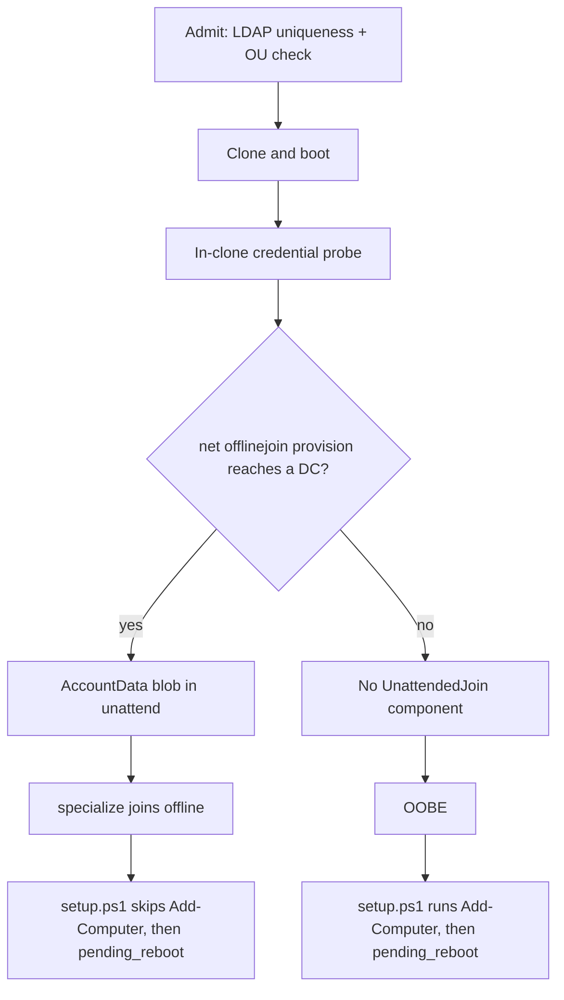

# Offline Domain Join (ODJ)

Design and implementation plan for joining AD during Sysprep `specialize` using a
pre-provisioned computer account blob instead of domain credentials in the
answer file.

**Status:** implemented behind `DOMAIN_JOIN_ODJ` (default off). Win11 DHCP + AD
is **confirmed in lab** (`odj-dhcp-win11`, 2026-08-16). Win11 **static** + AD is
confirmed (`odj-static-win11`, `W11ST191727` / `192.168.123.211`). Soft fallback
when the GuestOS worker cannot reach a DC is confirmed (`odj-fallback`,
`W11FB193536`, late `Add-Computer`). See
[SMOKE_BACKLOG.md](SMOKE_BACKLOG.md). Late `Add-Computer` in `setup.ps1` remains
the fallback and is unchanged.

Worker and guest logs use a stable `join-path:` prefix:

- `join-path: host_dc=reachable target=…` / `host_dc=unreachable` — whether
  the GuestOS host/worker could open TCP 53/88/389 to a DC (advisory).
- `join-path: provision=odj` or `provision=add-computer reason=…` — which
  path was chosen before Sysprep.
- Guest `setup.ps1: join-path method=odj|add-computer` and registry
  `HKLM\SOFTWARE\GuestOS\SetupJoinMethod`. Verify includes this in the
  SUCCESS line (`domain[…]: joined (lab.test, odj, host DC reachable)`).

## Why

The credential-based `Microsoft-Windows-UnattendedJoin` path fails in this lab
with `0x52e` on every attempt and burns ~15 minutes of `specialize` per deploy.
Full evidence and the disproven hypotheses are in
[UNATTENDED_JOIN_INVESTIGATION.md](UNATTENDED_JOIN_INVESTIGATION.md).

vSphere Guest Customization uses that same `DJOIN.EXE`-at-specialize mechanism,
so matching VMware here would mean matching a design that is failing for us.
ODJ is what Microsoft's own modern provisioning uses (MDT/SCCM offline join,
Autopilot hybrid join via the Intune ODJ connector), and it is strictly better
for our purposes:

- It cannot produce `ERROR_LOGON_FAILURE`. There is no user credential and no
  SMB session from the guest at join time.
- It needs no network at join time, so it is not restricted to DHCP guests the
  way the credential experiment was. Static-IP guests can join pre-OOBE too.
- The answer file carries a machine-account blob rather than a domain join
  password, which shrinks two P1 items in
  [VMWARE_GAP_ANALYSIS.md](VMWARE_GAP_ANALYSIS.md) §4.

## Flow



Provisioning runs late — after the clone exists and the in-clone credential
probe has passed — so we do not create AD objects for VMs that never boot.

## Answer file shape

With `Provisioning`, no credentials appear in the answer file at all. Microsoft
documents that `Provisioning` wins when both it and `Credentials` are present,
so we emit only one:

```xml
<Identification>
    <Provisioning>
        <AccountData>BASE64-ENCODED-BLOB</AccountData>
    </Provisioning>
</Identification>
```

The OU is applied at provisioning time (`machine_account_ou=`), not in the
answer file. The component is omitted entirely when there is no blob, which also
removes the ~15 minute `specialize` stall from every DHCP + AD deploy.

## Blob generation

Samba 4.15+ ships a `djoin.exe` equivalent. Our worker image is Debian 13
trixie (Samba 4.22), so `samba-common-bin` provides `/usr/bin/net`:

```
net -s /dev/null offlinejoin provision \
    domain=<dns domain> machine_name=<hostname> \
    [machine_account_ou=<ou>] dcname=<dc> printblob -U <user>
```

`printblob` writes the base64 blob to stdout, so nothing touches disk. The
password is passed through the environment rather than argv so it never appears
in the process list. The DC is passed explicitly (`dcname=`) because the
container's resolver does not necessarily know the AD domain; the target comes
from the same list `check_domain_join_preflight` probes.

## Decisions

| Question | Decision |
|---|---|
| Control plane cannot reach a DC | Fall back to late `Add-Computer`, no task failure. Host-to-AD stays advisory, as in [AD_VALIDATION.md](AD_VALIDATION.md). |
| Blob generation | Samba `net offlinejoin provision` in the worker image. |
| Default | `DOMAIN_JOIN_ODJ` off until the lab confirms it, then flip. |
| Stale computer accounts | Left as-is for now. Provisioning creates the object before the guest consumes it, so a failed deploy can leave one behind; `host_ldap_check_computer_exists` will then refuse a retry of the same hostname with a clear message. This matches the existing policy of not auto-deleting failed clones. |

## Work items

1. **Done** — `samba-common-bin` in [../Dockerfile](../Dockerfile). Client binary
   only, no daemons.
2. **Done** — `DOMAIN_JOIN_ODJ` and `DOMAIN_JOIN_ODJ_TIMEOUT_SECONDS` (default
   60s) in [../config.py](../config.py).
3. **Done** — [../app/domain_odj.py](../app/domain_odj.py) exposing
   `provision_odj_blob(data, hostname) -> str | None`: bounded timeout, returns
   `None` on any failure, logs a failure class and never the blob or password.
   It re-reads the password out of `domain_join_b64`, because
   `_prepare_domain_join` has already popped `domain_password` by then.
4. **Done** — [../app/sysprep_render.py](../app/sysprep_render.py): dropped the
   `unattend_join_*` credential fields, accepts `data['odj_account_data']`, and
   pops it right after the unattend render so it cannot linger in the Celery
   payload (same treatment `unattend_join_password` had).
5. **Done** — [../app/templates/sysprep/unattended.xml](../app/templates/sysprep/unattended.xml):
   emits `Provisioning`/`AccountData`; the `Credentials` / `JoinDomain` /
   `TimeoutPeriodInMinutes` branch is gone.
6. **Done** — [../app/celery_app.py](../app/celery_app.py): provisions immediately
   before the final render, after the in-clone credential probe. Failure is a
   warning, not a task failure.
7. **Done** — [../tests/test_domain_odj.py](../tests/test_domain_odj.py) covers
   blob extraction, password-out-of-argv, UPN and `DOMAIN\user` splitting,
   unpacking from `domain_join_b64`, DC failover, and every soft-failure path
   (disabled, no `net`, non-zero exit, zero exit without a blob, timeout,
   `OSError`). [../tests/test_sysprep.py](../tests/test_sysprep.py) covers the
   rendered answer file with and without a blob.
8. **Partial** — Lab Win11 DHCP + AD confirmed 2026-08-16 (`W11ODJ111506` /
   VMID 121): no specialize stall (~9s vs ~15 min), `PartOfDomain` true before
   OOBE, `Add-Computer` skipped, hostname survived. Win11 **static** + AD and
   the fallback path are still open. The Samba provisioner also needs the DC's
   own FQDN to resolve on the GuestOS host; `_dc_fqdn` / `_ensure_resolvable`
   add a hosts entry when the container's resolver does not know the AD domain.

## Enabling it

`DOMAIN_JOIN_ODJ` is off by default. To try it in lab, set it in `.env` and
rebuild so the image picks up `samba-common-bin`:

```bash
DOMAIN_JOIN_ODJ=1
DOMAIN_JOIN_ODJ_TIMEOUT_SECONDS=60
```

With it off, or on any provisioning failure, behaviour is exactly what it was
before this change: no `UnattendedJoin` component and a late `Add-Computer`.

## Risks

- The `<ComputerName>` in Shell-Setup must match the machine name inside the
  blob. Both come from `data['hostname']`, but a mismatch is a known way to break
  ODJ and is worth asserting in the first lab run.
- Samba-generated blobs consumed by Windows 11 24H2 are documented as supported
  in both directions but are unproven here. This is the main thing the first
  smoke tests.
- The join account now needs create-computer rights in the target OU from the
  control plane rather than from the guest. Same right, different source address.
- `TimeoutPeriodInMinutes` is parsed but ignored by DJOIN (see the investigation
  doc), so there is no way to bound a failed join other than omitting the
  component — which is what we now do.
