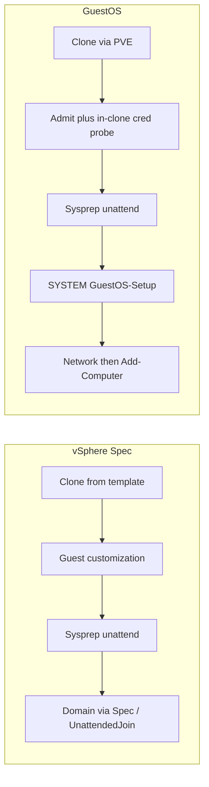

# GuestOS vs VMware Guest Customization Spec — gap analysis

**Audience:** operators and reviewers comparing Proxmox GuestOS customization to
vSphere Guest Customization Specifications (security + functionality).

**GuestOS baseline:** 2.7.1+ (current tree after AutoLogon removal; primary
runner is SYSTEM scheduled task `GuestOS-Setup`).

**VMware baseline:** vSphere **Guest Customization Specification** for Windows
(Sysprep / unattend) and Linux (VMware Tools / scripting), as documented in
Broadcom vSphere Virtual Machine Administration and the vCenter Guest API
(`windows_configuration` / `gui_unattended`).

**Ratings used below**

| Rating | Meaning |
|--------|---------|
| **Parity** | Same outcome / comparable control |
| **Gap** | VMware Spec has it (or handles it more safely); GuestOS weaker or missing |
| **Ahead** | GuestOS stronger or richer than classic Spec |
| **Different** | Intentional design difference; not a strict deficiency |

This document is **analysis only**. It does not change runtime behavior.

---

## 1. Purpose and scope

### In scope

- Clone-from-template → customize guest identity, network, domain/workgroup
- Where secrets live, how long they live on the guest, and scrub behavior
- Named presets (GuestOS “Customization Specs” vs vSphere Spec Manager)
- Linux golden-image customize (GuestOS cloud-init vs VMware Linux customization)

### Out of scope / related only

| Topic | Why |
|-------|-----|
| Horizon Instant Clone / ClonePrep / AppVolumes | Different product surface; GuestOS has no Instant Clone analogue. Credential *preflight spirit* is noted in [AD_VALIDATION.md](AD_VALIDATION.md); not compared in depth here. |
| vRealize / Aria Automation, Terraform providers | Orchestration layers above Spec / GuestOS |
| ESXi-only without vCenter Spec Manager | Partial feature set |
| Implementing remediations listed in §7 | Backlog recommendations only |

---

## 2. Architecture (side by side)

| Phase | VMware Spec | GuestOS |
|-------|-------------|---------|
| Clone | vCenter clone / deploy from template | PVE clone from Windows/Linux template |
| Preflight | Spec validation; optional Horizon-style credential checks elsewhere | Admit TCP 53/88/389 ([`domain_preflight.py`](../app/domain_preflight.py)); host LDAP uniqueness/OU; optional UI test; **in-clone** ADSI bind before Sysprep write ([`domain_guest_probe.py`](../app/domain_guest_probe.py)) |
| Generalize | Sysprep + generated unattend | Sysprep + GuestOS-rendered [`unattended.xml`](../app/templates/sysprep/unattended.xml) |
| Post-OOBE work | Often AutoLogon / GuiRunOnce / FirstLogonCommands; domain may join via Spec | **No** AutoLogon; SYSTEM task `GuestOS-Setup` → [`setup.ps1`](../app/templates/sysprep/setup.ps1) |
| Network | Spec NIC settings applied during customization | Applied in `setup.ps1` after OOBE (DHCP/static/DNS/multi-NIC) |
| Domain join | Spec “Windows Server Domain” (+ OU); typically unattend/UnattendedJoin path | Late `Add-Computer` in `setup.ps1` (native unattend `JoinDomain` **not** enabled yet) |
| Verify | Customization status in vCenter | QGA markers / HKLM `SetupStatus` ([`sysprep_verify.py`](../app/sysprep_verify.py)) |

---

## 3. Functionality matrix

| Capability | VMware Spec | GuestOS | Rating |
|------------|-------------|---------|--------|
| Hostname / computer name | Yes | Yes | **Parity** |
| New SID (Sysprep generalize) | Explicit “Generate new SID” | Sysprep `/generalize` | **Parity** |
| Timezone / locale | Yes | Yes | **Parity** |
| Product key / licensing | Spec license page | Unattend key + Server GVLK/Eval branches | **Parity** |
| Set local Administrator password | Yes (stored encrypted in Spec) | Yes (entered per deploy; Specs do **not** store it) | **Different** |
| AutoLogon as Administrator | Optional (`auto_logon` / count) | **Removed** — SYSTEM task runner | **Ahead** (security); **Different** (ops) |
| FirstLogonCommands / GuiRunOnce | Supported in Spec / API | Not used; `GuestOS-Setup` replaces that role | **Different** |
| Workgroup | Yes | Yes | **Parity** |
| Domain join + OU | Yes (domain + credentials + OU path) | Yes (`Add-Computer`, optional `domain_ou`) | **Parity** (outcome); join **mechanism** **Gap** (no UnattendedJoin) |
| DHCP / static IPv4 + DNS | Yes | Yes | **Parity** |
| Multi-NIC | Yes | Yes (≤8; MAC then order) | **Parity** (code); lab matrix incomplete for Windows multi-NIC |
| IPv6 | Spec-dependent | Supported in validators / setup | **Parity** (code); limited Windows lab |
| Credential test / preflight | Spec UI validation; Horizon pool checks elsewhere | TCP + host LDAP + in-clone probe + `POST /api/domain/test_credentials` | **Ahead** |
| Named presets | Customization Specification Manager (can hold secrets) | GuestOS Customization Specs (**non-secret** presets) | **Different** |
| Bulk / fleet deploy | Templates + Spec + orchestrators | Bulk Win11 CSV/API (quotas) | **Different** |
| Linux customize | Tools-based / cloud-init guests | Proxmox cloud-init + QGA verify | **Parity** (intent); **Different** (stack) |
| Server data disks / pagefile volume | Not a classic Spec concern | `manage_disks` planner + verify | **Ahead** |
| Domain join failure semantics | Customization often **fails** | Soft fail → marker `domain-join-failed`, task **WARNING** | **Different** / mild **Gap** if hard-fail is required |
| In-place customize of running prod VM | Generally clone/deploy oriented | Explicitly **disabled** for Sysprep | **Parity** (safe default) |

---

## 4. Security matrix

| Topic | VMware Spec | GuestOS | Rating |
|-------|-------------|---------|--------|
| Where deploy passwords live | Encrypted in vCenter DB as part of Spec / secret fields | Per-task stash (Redis/SQLite via [`task_secrets.py`](../app/task_secrets.py)); **not** on Celery broker; Specs omit passwords | **Different**; GuestOS Specs are stricter; vCenter encryption is mature platform crypto |
| AD join account at rest on control plane | Encrypted in Spec / VCDB | `DOMAIN_PROFILES_JSON` in `.env` (plaintext on GuestOS host) — see [SECURITY.md](../SECURITY.md) | **Gap** |
| Unattend admin password encoding | Typically Base64 in generated unattend | `<PlainText>true</PlainText>` in [`unattended.xml`](../app/templates/sysprep/unattended.xml) (admin + temporary `GuestOSOobe`) | **Gap** |
| Domain join secret on guest | Often UnattendedJoin / shorter answer-file window | Packed into `domain_join_b64` inside `SetupPs1B64` (HKLM) until final scrub; **kept** across `pending_reboot` | **Gap** |
| Winlogon `DefaultPassword` / AutoAdminLogon | Optional AutoLogon writes admin password for N logons | Explicitly cleared; no AutoLogon in unattend ([`setup.ps1`](../app/templates/sysprep/setup.ps1) `Clear-GuestOsWinlogonSecrets`) | **Ahead** |
| Brief guest disk during cred probe | N/A (host-side checks) | `cred.json` under `ProgramData\GuestOS\credprobe\` then deleted in `finally` | **Different** (acceptable with scrub) |
| API / RBAC | vCenter roles | Flask session+CSRF, Bearer `GUESTOS_API_TOKEN`, PDM HMAC launch | **Different** |
| Control-plane blast radius | Compromise vCenter ≈ Spec secrets + inventory | Compromise GuestOS host ≈ PVE API user + AD profiles + tokens ([SECURITY.md](../SECURITY.md)) | **Parity** (treat host as sensitive) |
| Job / history scrubbing | Spec secrets not shown in UI | Passwords stripped from task options; `domain_username` retained; probe failures omit password | **Parity** / mild **Gap** (username retained by design) |
| Failed clone cleanup | Operator / policy dependent | Failed clones renamed/tagged; **not** auto-deleted | **Different** |

---

## 5. Confirmed gaps (prioritized)

### P1 — security

1. **Plaintext unattend passwords** — Administrator and `GuestOSOobe` use `PlainText>true` until `setup.ps1` deletes answer files / Panther copies.
2. **Join secrets durable in HKLM** — `SetupPs1B64` can contain `domain_join_b64` from first boot through domain-join reboot until final `done` scrub.

### P1 — functionality

3. **No native unattend `JoinDomain` / Microsoft-Windows-UnattendedJoin** — join remains late `Add-Computer` after OOBE ([AD_VALIDATION.md](AD_VALIDATION.md)). Deferred until the SYSTEM runner path is considered stable enough to add a second join mechanism.

### P2

4. **Soft domain-join failure** — OS/network can SUCCESS with WARNING; VMware operators often expect customization **failure** when join fails. Make hard-fail configurable if parity is required.
5. **Customization Specs cannot store admin password** — reduces secret sprawl vs VMware, but more operator friction per deploy.

### P3 — lab / matrix coverage

6. Windows static IP + AD was historically matrix-thin for 2019/2022/Win11 (2025 Eval static was OK). **Server 2019 Eval static + AD + disks** reconfirmed **2026-08-14** (`S19ST224349`, `192.168.123.210`) — see [VALIDATED_MATRIX.md](VALIDATED_MATRIX.md).
7. Windows multi-NIC / IPv6 still mostly code-covered, not fully lab-smoked.

---

## 6. Where GuestOS is ahead or intentionally different

- **No interactive AutoLogon** — avoids Winlogon `DefaultPassword`; post-OOBE work runs as SYSTEM via `GuestOS-Setup` (AtStartup + first-boot Once/repeat catch-up). `SetupComplete.cmd` is a safety net only (must not run full `setup.ps1` during specialize) — [FAILURE_RUNBOOK.md](FAILURE_RUNBOOK.md).
- **Layered AD validation** — admit TCP, host LDAP (hostname uniqueness / OU), UI/API credential test, in-clone QGA bind before Sysprep.
- **Secrets off the Celery broker** — one-shot task secret stash with TTL.
- **Named Specs without passwords** — presets for non-secret fields only.
- **Server disk / pagefile planner** — beyond classic Guest Customization Spec scope.
- **In-place Sysprep disabled** — reduces accidental generalize of production guests.

**Intentional timing note:** in-clone cred probe uses template/DHCP (or any non–link-local IPv4) on the already-attached bridge/VLAN — **not** the final static IP. That answers “can this account bind from this L2 path?” Final static address is applied later in `setup.ps1` ([FAILURE_RUNBOOK.md](FAILURE_RUNBOOK.md), [AD_VALIDATION.md](AD_VALIDATION.md)).

---

## 7. Recommendations (backlog only)

Ranked for a future change set — **not** implemented by this document.

| Priority | Item | Intent |
|----------|------|--------|
| P1 | Encode unattend admin / `GuestOSOobe` passwords as Base64 (`PlainText>false`) | Shrink answer-file exposure window |
| P1 | Split join secrets from durable `SetupPs1B64`, or scrub join blob earlier after successful `Add-Computer` (before pagefile reboot if possible) | Shorten HKLM secret lifetime |
| P1 | Optional Microsoft-Windows-UnattendedJoin after runner stability | Closer Spec-parity join path; attribute failures carefully |
| P2 | Config flag: hard-fail task when domain join fails | Match VMware fail-closed expectations |
| P2 | Encrypt-at-rest for `DOMAIN_PROFILES_JSON` (or external secret store) | Reduce GuestOS-host plaintext AD creds |
| P3 | Lab: Win11 + 2022 static+AD rows; Windows multi-NIC smoke | Close matrix gaps |

---

## 8. Sources

### GuestOS

- [SECURITY.md](../SECURITY.md) — threat model
- [AD_VALIDATION.md](AD_VALIDATION.md) — join layers, deferred UnattendedJoin
- [FAILURE_RUNBOOK.md](FAILURE_RUNBOOK.md) — runner, scrub, probe timing
- [WINDOWS_TEMPLATE.md](WINDOWS_TEMPLATE.md) — template requirements
- [VALIDATED_MATRIX.md](VALIDATED_MATRIX.md) — lab coverage
- [`app/domain_preflight.py`](../app/domain_preflight.py), [`app/domain_guest_probe.py`](../app/domain_guest_probe.py), [`app/task_secrets.py`](../app/task_secrets.py)
- [`app/templates/sysprep/unattended.xml`](../app/templates/sysprep/unattended.xml), [`setup.ps1`](../app/templates/sysprep/setup.ps1)

### VMware / Broadcom

- [Create a Customization Specification for Windows](https://techdocs.broadcom.com/us/en/vmware-cis/vsphere/vsphere/9-1/vsphere-virtual-machine-administration/managing-virtual-machines/customizing-guest-operating-systems/create-and-manage-customization-specifications/create-a-customization-specification-for-windows-in-the-vsphere-client.html) — SID, admin password, optional AutoLogon, workgroup/domain + OU, network
- vCenter Guest API `windows_configuration` / `gui_unattended` (`auto_logon`, `auto_logon_count`, domain secret fields)

---

## 9. Summary verdict

GuestOS reaches **functional parity** with a classic vSphere Windows Customization Spec for the common path: hostname, Sysprep SID, network, domain/workgroup, Linux cloud-init-style customize. It is **ahead** on avoiding AutoLogon and on layered AD preflight, and **ahead** on Server disk/pagefile automation.

The main **security gaps** vs a well-operated vCenter Spec are: plaintext unattend password encoding, plaintext AD profiles on the GuestOS host, and a longer on-guest lifetime for domain-join material inside `SetupPs1B64`. The main **functional gap** is lack of native UnattendedJoin (deferred), plus soft-fail domain semantics if operators expect hard customization failure.
