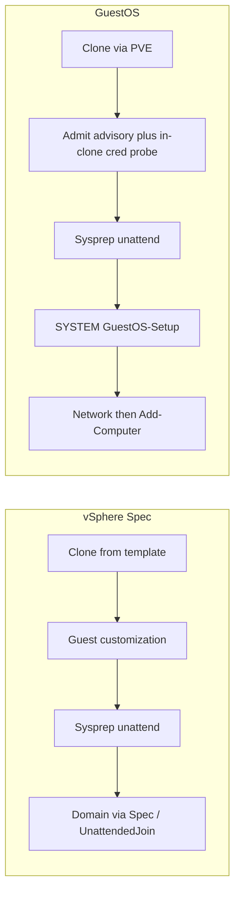

# GuestOS vs VMware Guest Customization Spec — assessment

**Audience:** operators and reviewers comparing Proxmox GuestOS customization to
vSphere Guest Customization Specifications.

**GuestOS baseline:** 2.7.1+ current tree (SYSTEM scheduled task `GuestOS-Setup`;
no AutoLogon; host DC preflight advisory; in-clone cred probe is the hard gate).

**VMware baseline:** vSphere **Guest Customization Specification** for Windows
(Sysprep / unattend) and Linux (VMware Tools / scripting), as documented in
Broadcom vSphere Virtual Machine Administration and the vCenter Guest API
(`windows_configuration` / `gui_unattended`).

This document is **analysis only**. It does not change runtime behavior.

**Ratings**

| Rating | Meaning |
|--------|---------|
| **Parity** | Same outcome / comparable control |
| **Gap** | VMware Spec has it (or handles it more safely); GuestOS weaker or missing |
| **Ahead** | GuestOS stronger or richer than classic Spec |
| **Different** | Intentional design difference; not a strict deficiency |

---

## 1. Purpose and scope

### In scope

- Clone-from-template → customize guest identity, network, domain/workgroup
- Where secrets live, how long they live on the guest, and scrub behavior
- Named presets (GuestOS “Customization Specs” vs vSphere Spec Manager)
- Linux golden-image customize (GuestOS cloud-init vs VMware Linux customization)
- Who runs each AD check (GuestOS host vs guest VM vs verify worker) and fail severity

### Out of scope / related only

| Topic | Why |
|-------|-----|
| Horizon Instant Clone / ClonePrep / AppVolumes | Different product surface; short note in [Appendix B](#appendix-b-horizon-instant-clone--cloneprep). Credential *preflight spirit* is noted in [AD_VALIDATION.md](AD_VALIDATION.md). |
| vRealize / Aria Automation, Terraform providers | Orchestration layers above Spec / GuestOS |
| ESXi-only without vCenter Spec Manager | Partial feature set |
| Implementing remediations listed in §6 | Backlog recommendations only |

---

## 2. Architecture (side by side)

| Phase | VMware Spec | GuestOS |
|-------|-------------|---------|
| Clone | vCenter clone / deploy from template | PVE clone from Windows/Linux template |
| Preflight | Spec validation; optional Horizon-style credential checks elsewhere | UI test + host TCP/LDAP **advisory** when the GuestOS host cannot reach AD; **in-clone** ADSI bind before Sysprep is the hard gate ([`domain_preflight.py`](../app/domain_preflight.py), [`domain_guest_probe.py`](../app/domain_guest_probe.py)) |
| Generalize | Sysprep + generated unattend | Sysprep + GuestOS-rendered [`unattended.xml`](../app/templates/sysprep/unattended.xml) |
| Post-OOBE work | Often AutoLogon / GuiRunOnce / FirstLogonCommands; domain may join via Spec | **No** AutoLogon; SYSTEM task `GuestOS-Setup` → [`setup.ps1`](../app/templates/sysprep/setup.ps1) |
| Network | Spec NIC settings applied during customization | Applied in `setup.ps1` after OOBE (DHCP/static/DNS/multi-NIC) |
| Domain join | Spec “Windows Server Domain” (+ OU); credential-based unattend/UnattendedJoin | **Offline Domain Join** blob at specialize when provisioning succeeds (`DOMAIN_JOIN_ODJ`), else late `Add-Computer` in `setup.ps1` |
| Verify | Customization status in vCenter | QGA markers / HKLM `SetupStatus` ([`sysprep_verify.py`](../app/sysprep_verify.py)) |

---

## 3. Functionality assessment

### 3.1 Capability matrix

| Capability | VMware Spec | GuestOS | Rating |
|------------|-------------|---------|--------|
| Hostname / computer name | Yes | Yes | **Parity** |
| New SID (Sysprep generalize) | Explicit “Generate new SID” | Sysprep `/generalize` | **Parity** |
| Timezone / locale | Yes | Yes | **Parity** |
| Product key / licensing | Spec license page | Unattend key + Server GVLK/Eval branches | **Parity** |
| Set local Administrator password | Yes (stored encrypted in Spec) | Yes (entered per deploy; Specs do **not** store it) | **Different** |
| AutoLogon as Administrator | Optional (`auto_logon` / count) | **Removed** — SYSTEM task runner | **Ahead** (security); **Different** (ops) |
| FirstLogonCommands / GuiRunOnce | Supported in Spec / API | Not used; `GuestOS-Setup` replaces that role | **Different** |
| Workgroup | Yes | Yes | **Parity** |
| Domain join + OU | Yes (domain + credentials + OU path) | Yes (ODJ blob at specialize, else `Add-Computer`; optional `domain_ou`) | **Parity** (outcome); join **mechanism** **Ahead** (no credentials in the answer file) — [Appendix A](#appendix-a-unattendedjoin-vs-late-add-computer) |
| DHCP / static IPv4 + DNS | Yes | Yes | **Parity** |
| Multi-NIC | Yes | Yes (≤8; MAC then order) | **Parity** (code); lab matrix incomplete for Windows multi-NIC |
| IPv6 | Spec-dependent | Supported in validators / setup | **Parity** (code); limited Windows lab |
| Credential test / preflight | Spec UI validation; Horizon pool checks elsewhere | UI test (advisory) + host TCP/LDAP (advisory if unreachable) + **in-clone probe** (hard) | **Ahead** (layered; guest path is authoritative) |
| Named presets | Customization Specification Manager (can hold secrets) | GuestOS Customization Specs (**non-secret** presets) | **Different** |
| Bulk / fleet deploy | Templates + Spec + orchestrators | Bulk Win11 CSV/API (quotas) | **Different** |
| Linux customize | Tools-based / cloud-init guests | Proxmox cloud-init + QGA verify | **Parity** (intent); **Different** (stack) |
| Server data disks / pagefile volume | Not a classic Spec concern | `manage_disks` planner + verify | **Ahead** |
| Domain join failure semantics | Customization typically **fails** | Guest is left usable (`setup.done` + `domain-join-failed`); **job is `FAILURE`** with WARNING text in the message | **Parity** (job fails); **Different** (guest not stuck mid-setup) |
| In-place customize of running prod VM | Generally clone/deploy oriented | Explicitly **disabled** for Sysprep | **Parity** (safe default) |

### 3.2 AD join check timeline (source + severity)

Sources: **GuestOS host** = web/worker container on the GuestOS appliance;
**Guest VM** = the clone (QGA or SYSTEM task); **GuestOS app** = request
validation / orchestration.

| When | What | Source | Fail severity |
|------|------|--------|----------------|
| Domain step (optional) | **Test credentials** — LDAP bind using Network DNS | GuestOS host → DC | **Advisory** — wizard can continue |
| Admit (start job) | Username form (UPN / `DOMAIN\user`); required password | GuestOS app | **Critical** — HTTP 400, no clone |
| Admit | TCP 53/88/389 to `dns_servers` | GuestOS host → DC/DNS | **Advisory** — `warnings[]`; job still starts (guest VLAN may reach AD) |
| Admit | LDAP: hostname uniqueness + OU DN | GuestOS host → DC | **Critical** if LDAP is reachable (collision / bad OU / bad password). **Skipped** (log warning) if LDAP unreachable |
| Worker (early) | Same TCP preflight | GuestOS host (clone worker) | **Advisory** — does not fail the task |
| After QGA, before Sysprep | In-clone ADSI bind | Guest VM via QGA (template/DHCP IP on clone VLAN) → DC | **Critical** — `FAILURE` / `domain_cred_probe` |
| After OOBE (`setup.ps1`) | Network, then `Add-Computer` | Guest VM SYSTEM `GuestOS-Setup` → DC | Join OK → reboot; join fail → `domain-join-failed` marker (guest usable) |
| Verify | Hostname, IP, `PartOfDomain` | GuestOS verify worker via QGA | Not joined when join was requested → **`FAILURE`** (`error_code=verify`) + WARNING text; joined → **SUCCESS** |

**Practical takeaway:** a GuestOS host that cannot reach AD must not block clone.
The in-clone probe answers “can this guest path bind?” If that passes and
`Add-Computer` later fails, the VM is customized but the **job is still FAILURE**.

---

## 4. Security assessment

| Topic | VMware Spec | GuestOS | Rating |
|-------|-------------|---------|--------|
| Where deploy passwords live | Encrypted in vCenter DB as part of Spec / secret fields | Per-task stash (Redis/SQLite via [`task_secrets.py`](../app/task_secrets.py)); **not** on Celery broker; Specs omit passwords | **Different**; GuestOS Specs are stricter; vCenter encryption is mature platform crypto |
| AD join account at rest on control plane | Encrypted in Spec / VCDB | `DOMAIN_PROFILES_JSON` in `.env` (plaintext on GuestOS host) — see [SECURITY.md](../SECURITY.md) | **Gap** |
| Unattend admin password encoding | Typically Base64 in generated unattend | `<PlainText>true</PlainText>` in [`unattended.xml`](../app/templates/sysprep/unattended.xml) (admin + temporary `GuestOSOobe`) | **Gap** |
| Domain join secret on guest | Join account password in the unattend answer file | ODJ path ships only a machine-account blob (no join account anywhere in the guest); `Add-Computer` fallback packs `domain_join_b64` into `SetupPs1B64` (HKLM) until final scrub, **kept** across `pending_reboot` | **Ahead** when ODJ provisions; **Gap** on the fallback |
| Winlogon `DefaultPassword` / AutoAdminLogon | Optional AutoLogon writes admin password for N logons | Explicitly cleared; no AutoLogon in unattend ([`setup.ps1`](../app/templates/sysprep/setup.ps1) `Clear-GuestOsWinlogonSecrets`) | **Ahead** |
| Brief guest disk during cred probe | N/A (host-side checks) | `cred.json` under `ProgramData\GuestOS\credprobe\` then deleted in `finally` | **Different** (acceptable with scrub) |
| API / RBAC | vCenter roles | Flask session+CSRF, Bearer `GUESTOS_API_TOKEN`, PDM HMAC launch | **Different** |
| Control-plane blast radius | Compromise vCenter ≈ Spec secrets + inventory | Compromise GuestOS host ≈ PVE API user + AD profiles + tokens ([SECURITY.md](../SECURITY.md)) | **Parity** (treat host as sensitive) |
| Job / history scrubbing | Spec secrets not shown in UI | Passwords stripped from task options; `domain_username` retained; probe failures omit password | **Parity** / mild **Gap** (username retained by design) |
| Failed clone cleanup | Operator / policy dependent | Failed clones renamed/tagged; **not** auto-deleted | **Different** |

### Confirmed security gaps (prioritized)

**P1**

1. **Plaintext unattend passwords** — Administrator and `GuestOSOobe` use `PlainText>true` until `setup.ps1` deletes answer files / Panther copies.
2. **Join secrets durable in HKLM** — on the `Add-Computer` fallback path, `SetupPs1B64` can contain `domain_join_b64` from first boot through domain-join reboot until final `done` scrub. The ODJ path avoids this entirely.

**P2**

3. **`DOMAIN_PROFILES_JSON` plaintext** on the GuestOS host.
4. Customization Specs cannot store admin password — reduces sprawl vs VMware, more operator friction per deploy.

---

## 5. Where GuestOS is ahead or intentionally different

- **No interactive AutoLogon** — avoids Winlogon `DefaultPassword`; post-OOBE work runs as SYSTEM via `GuestOS-Setup` (AtStartup + first-boot Once/repeat catch-up). `SetupComplete.cmd` is a safety net only — [FAILURE_RUNBOOK.md](FAILURE_RUNBOOK.md).
- **Layered AD validation with guest-path authority** — UI test and host TCP/LDAP do not block when the appliance cannot reach AD; in-clone QGA bind before Sysprep does.
- **Secrets off the Celery broker** — one-shot task secret stash with TTL.
- **Named Specs without passwords** — presets for non-secret fields only.
- **Server disk / pagefile planner** — beyond classic Guest Customization Spec scope.
- **In-place Sysprep disabled** — reduces accidental generalize of production guests.

**Intentional timing note:** in-clone cred probe uses template/DHCP (or any non–link-local IPv4) on the already-attached bridge/VLAN — **not** the final static IP. That answers “can this account bind from this L2 path?” Final static address is applied later in `setup.ps1`.

---

## 6. Recommendations (backlog only)

Not implemented by this document.

| Priority | Item | Intent |
|----------|------|--------|
| P1 | Encode unattend admin / `GuestOSOobe` passwords as Base64 (`PlainText>false`) | Shrink answer-file exposure window |
| P1 | Split join secrets from durable `SetupPs1B64`, or scrub join blob earlier after successful `Add-Computer` | Shorten HKLM secret lifetime |
| P1 | ~~Optional Microsoft-Windows-UnattendedJoin~~ — done as Offline Domain Join (`DOMAIN_JOIN_ODJ`) | Spec-parity join *timing* without credentials in the guest |
| P2 | Encrypt-at-rest for `DOMAIN_PROFILES_JSON` (or external secret store) | Reduce GuestOS-host plaintext AD creds |
| P3 | Lab: Win11 + 2022 static+AD rows; Windows multi-NIC smoke | Close matrix gaps |

A configurable “SUCCESS with WARNING when only join fails” flag is **not** recommended as default: current verify already **fails the job** when join was requested and `PartOfDomain` is false. That matches typical VMware customization failure. The remaining difference is that the guest is left at a login screen (workgroup) instead of stuck mid-OOBE.

---

## 7. Summary verdict

GuestOS reaches **functional parity** with a classic vSphere Windows Customization Spec for the common path: hostname, Sysprep SID, network, domain/workgroup, Linux cloud-init-style customize. It is **ahead** on avoiding AutoLogon, on layered AD checks that treat the **guest VLAN** as authoritative, and on Server disk/pagefile automation.

The main **security gaps** vs a well-operated vCenter Spec are: plaintext unattend password encoding, plaintext AD profiles on the GuestOS host, and — on the `Add-Computer` fallback path — a longer on-guest lifetime for domain-join material inside `SetupPs1B64`. The join *mechanism* is no longer a gap: GuestOS joins during specialize using an Offline Domain Join blob, which is stronger than the credential-based UnattendedJoin a Spec drives, and falls back to late `Add-Computer` when the host cannot provision the account. Join failure fails the **job**; it does not leave customization marked SUCCESS.

---

## Appendix A — UnattendedJoin vs late Add-Computer

**Microsoft-Windows-UnattendedJoin** is an unattend component that joins AD during
**specialize** (early Sysprep). It supports two modes: `Credentials` (domain user
and password in the answer file) and `Provisioning` (an Offline Domain Join blob).
vSphere Customization Specs drive the **credential** mode when “Windows Server
Domain” is selected.

GuestOS tried the credential mode and abandoned it: it failed with `0x52e` on
every lab attempt while the same account authenticated fine over the same SMB
path from a booted guest, and a failed attempt costs ~15 minutes because
`TimeoutPeriodInMinutes` is ignored. Full evidence is in
[UNATTENDED_JOIN_INVESTIGATION.md](UNATTENDED_JOIN_INVESTIGATION.md). Note this
is not a Proxmox-specific problem — vSphere drives the same `DJOIN.EXE` and
Broadcom documents the same retry-loop symptom.

GuestOS now uses **Provisioning / `AccountData`** instead
([OFFLINE_DOMAIN_JOIN.md](OFFLINE_DOMAIN_JOIN.md)), falling back to
`Add-Computer` after OOBE when the computer account cannot be provisioned.

| Topic | Credential UnattendedJoin | GuestOS ODJ (specialize) | GuestOS late `Add-Computer` |
|-------|---------------------------|--------------------------|-----------------------------|
| When | During specialize | During specialize | After OOBE + network in `setup.ps1` |
| Network | Must already reach the DC | None needed — the blob is self-contained | Static IP/DNS applied first |
| Secrets | Domain join password in the answer file | Machine account password in the answer file | In HKLM `SetupPs1B64` until scrub |
| Blast radius of a leak | The join account | One computer account | The join account |
| DHCP/static | DC must be reachable, so DHCP-only in practice | Both | Both |
| Failure | Stalls specialize ~15 min, then continues | Provisioning fails on the host; guest never sees it | Guest marks `domain-join-failed`; verify **FAILURE** |

The trade-off ODJ introduces is a dependency the other two do not have: the
**GuestOS host** must reach a DC to provision. That is why it degrades to
`Add-Computer` rather than failing the job — host-to-AD reachability stays
advisory, per [AD_VALIDATION.md](AD_VALIDATION.md).

---

## Appendix B — Horizon Instant Clone / ClonePrep

Horizon Instant Clones are **not** a full Sysprep-per-desktop path. A **parent**
VM is prepared once; Horizon forks many short-lived desktops. **ClonePrep**
(historically also Sysprep / QuickPrep on linked clones) assigns identity and
domain membership in seconds, without GuestOS-style clone → generalize → OOBE →
`setup.ps1` for every pool member.

Horizon pool credential checks are mostly **control-plane** (can this join
account talk to AD?). GuestOS UI/admit tests are similar in spirit; GuestOS has
**no Instant Clone / parent–fork analogue**. Comparing ClonePrep to
`GuestOS-Setup` mixes VDI fork semantics with golden-image customize — out of
scope for this assessment.

---

## Sources

### GuestOS

- [SECURITY.md](../SECURITY.md) — threat model
- [AD_VALIDATION.md](AD_VALIDATION.md) — join layers
- [OFFLINE_DOMAIN_JOIN.md](OFFLINE_DOMAIN_JOIN.md) — specialize join design
- [UNATTENDED_JOIN_INVESTIGATION.md](UNATTENDED_JOIN_INVESTIGATION.md) — why credential UnattendedJoin was dropped
- [FAILURE_RUNBOOK.md](FAILURE_RUNBOOK.md) — runner, scrub, probe timing
- [WINDOWS_TEMPLATE.md](WINDOWS_TEMPLATE.md) — template requirements
- [VALIDATED_MATRIX.md](VALIDATED_MATRIX.md) — lab coverage
- [`app/domain_preflight.py`](../app/domain_preflight.py), [`app/domain_guest_probe.py`](../app/domain_guest_probe.py), [`app/task_secrets.py`](../app/task_secrets.py)
- [`app/templates/sysprep/unattended.xml`](../app/templates/sysprep/unattended.xml), [`setup.ps1`](../app/templates/sysprep/setup.ps1)

### VMware / Broadcom

- [Create a Customization Specification for Windows](https://techdocs.broadcom.com/us/en/vmware-cis/vsphere/vsphere/9-1/vsphere-virtual-machine-administration/managing-virtual-machines/customizing-guest-operating-systems/create-and-manage-customization-specifications/create-a-customization-specification-for-windows-in-the-vsphere-client.html) — SID, admin password, optional AutoLogon, workgroup/domain + OU, network
- vCenter Guest API `windows_configuration` / `gui_unattended` (`auto_logon`, `auto_logon_count`, domain secret fields)
